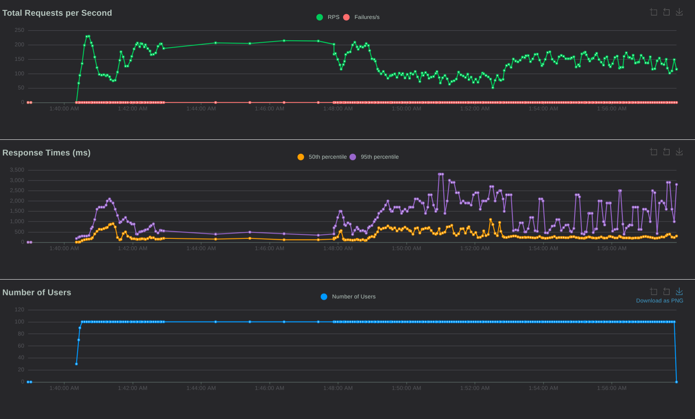

# High-Throughput Distributed Financial Ledger & Analytics Engine

A production-grade, asynchronous financial transaction engine built with **Python (FastAPI)** and **SQLAlchemy 2.0**. The platform uses the **CQRS (Command Query Responsibility Segregation)** pattern to isolate high-speed transaction updates from intensive historical queries, guaranteeing mathematical data integrity under heavy traffic.

## 🏗️ System Architecture


                                [ Client Request ]
                                         │
                                         ▼
                            [ FastAPI Ingestion API ]
                                         │
                    ┌────────────────────┴────────────────────┐
                    ▼                                         ▼
         [ PostgreSQL (OLTP) ]                     [ Transactional Outbox ]
      (Strict ACID / Row Locking)                 (Atomically Bound to DB)
                                                              │
                                                              ▼ (Polled by)
                                                   [ Outbox Worker Daemon ]
                                                              │
                                                              ▼ (Publishes to)
                                                    [ Apache Kafka ]
                                                              │
                                                              ▼ (Consumed by)
                                                   [ Batch Consumer ]
                                                              │
                                                              ▼ (Micro-Batched)
                                                 [ ClickHouse OLAP Warehouse ]
                                                  (Columnar Big Data Storage)


## 🛠️ Core Engineering Problems Solved

* **Race Conditions & Concurrency (OLTP)**: Solved by implementing **Pessimistic Row-Locking** (`SELECT ... FOR UPDATE`) in PostgreSQL. Concurrent requests trying to withdraw from the same target wallet are forced into a sequential database queue, preventing balance corruption.
* **The Distributed Dual-Write Problem**: Solved using the **Transactional Outbox Pattern**. Instead of running dual network writes to SQL and NoSQL simultaneously, events are committed to a local PostgreSQL `transaction_outbox` table within the same atomic ACID transaction block, eliminating cross-database desynchronization.
* **Analytical Resource Starvation (OLAP)**: Heavy analytical computations will freeze operational transaction tables. This engine pipes immutable ledger events into **ClickHouse**—a columnar data warehouse—enabling lightning-fast analytics across millions of rows without touching the live API.
* **Network Shock Absorption**: Implemented **Apache Kafka** to decouple components. If the data warehouse undergoes service updates or goes offline, Kafka securely buffers the message offsets, guaranteeing **At-Least-Once Delivery**.

## 📊 Stress-Test & Performance Benchmarks

The core API was subjected to an intense, multi-user saturation swarm utilizing **Locust** to evaluate resource contention safety boundaries:

* **Sustained Throughput**: **152.8 Requests Per Second (RPS)**
* **Volume Processed**: **160,996 Atomic Transactions**
* **System Error Rate**: **0.00% Failures**
* **Idempotency Protection**: Integrated a unique Redis/SQL caching index gate, returning an explicit `409 Conflict` to catch and drop network-level duplicate requests safely.

## ⚙️ Local Development & Ecosystem Execution

The entire network stack (PostgreSQL, Kafka, ClickHouse) is fully containerized via Docker.

### 1. Spin up the cluster infrastructure:
```bash
docker-compose up -d
```

### 2. Execute the single-command automation bootstrapper:
This wrapper checks infrastructure health, configures database table migrations, and launches all background workers simultaneously.
```bash
chmod +x run_system.sh
./run_system.sh
```

### 3. Verify analytics ingestion (ClickHouse):
```bash
docker-compose exec clickhouse clickhouse-client --query "SELECT * FROM analytical_ledger_events"
```

## 🚀 Continuous Integration (CI/CD)
This repository includes a native **GitHub Actions Pipeline** (`.github/workflows/ci-pipeline.yml`). Every commit automatically triggers isolated service containers in GitHub's cloud, boots the engine layers, and verifies system integrity rules using an integrated **PyTest** regression suite.


## 📊 Stress-Test & Performance Benchmarks

The core API was subjected to an intense, multi-user saturation swarm utilizing **Locust** to evaluate resource contention safety boundaries:

* **Sustained Throughput**: **152.8 Requests Per Second (RPS)**
* **Volume Processed**: **160,996 Atomic Transactions**
* **System Error Rate**: **0.00% Failures**

### 📈 Real-Time Performance Saturation Chart
